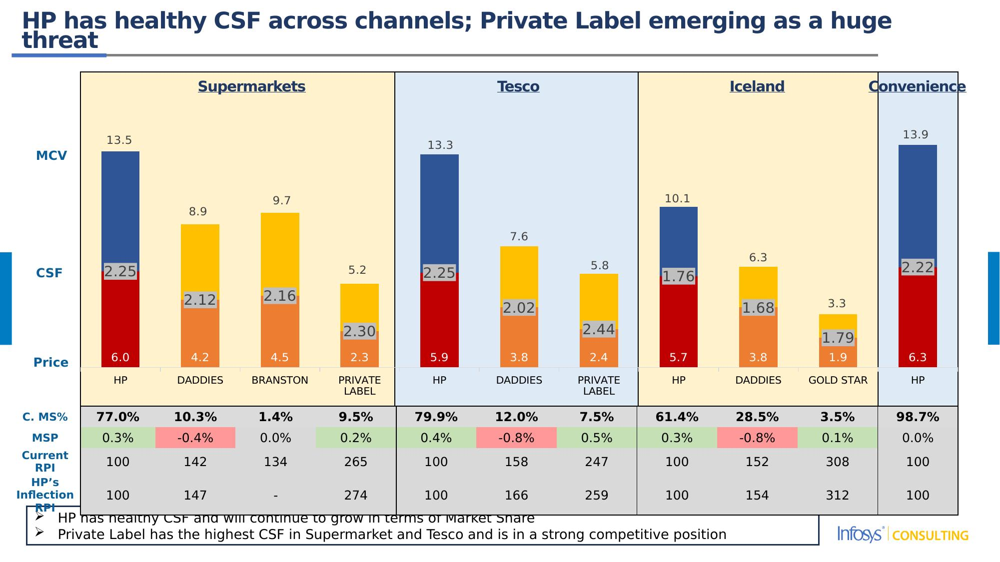
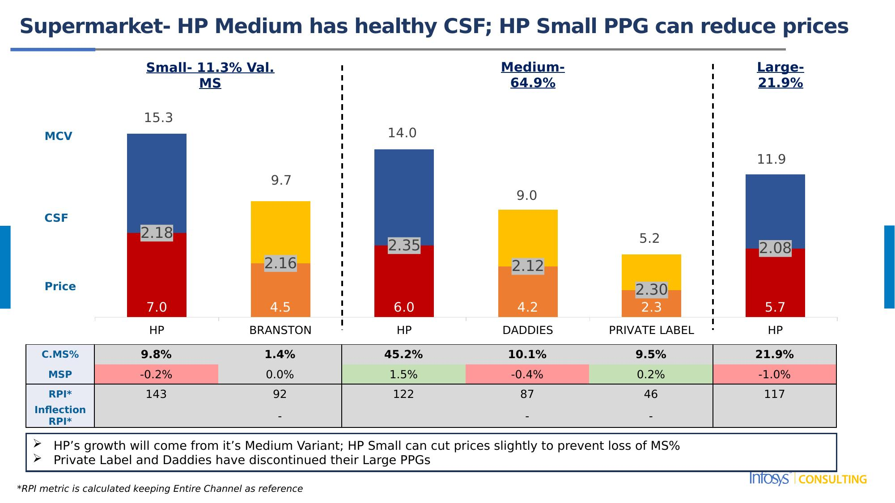
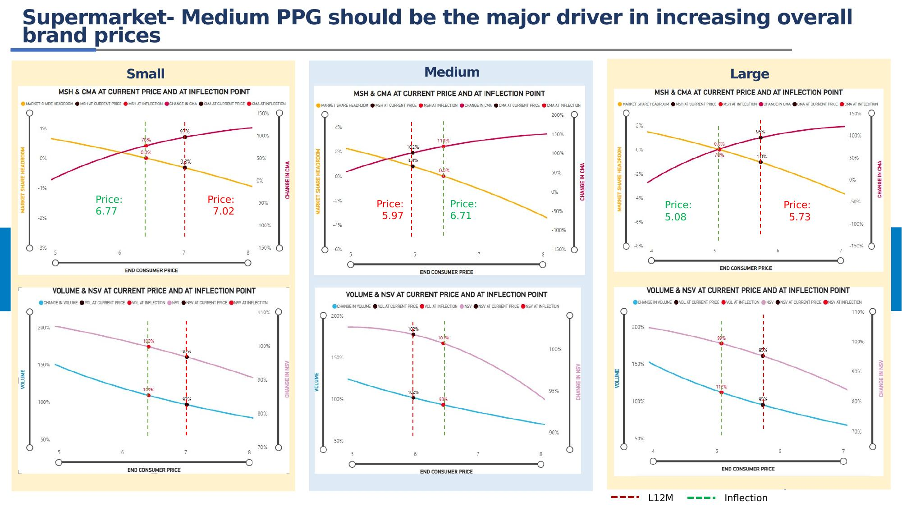
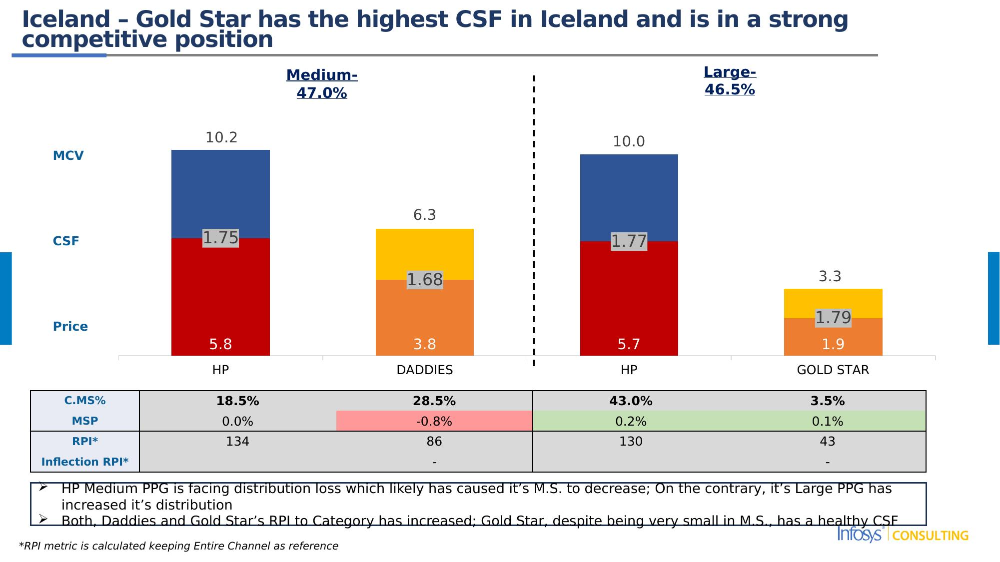
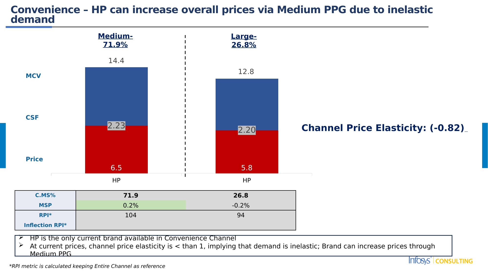
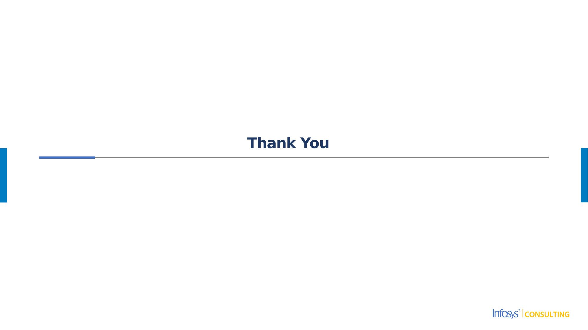

# Consumer Surplus Factor (CSF) Study
## HP KHC - UK: Brown Sauce
### June 2025

---

**Note:** For detailed alt-text descriptions of all slides, see [alt-texts.md](alt-texts.md)

---

## Slide 1

# Consumer Surplus Factor (CSF) studyskadKHC – UK : Brown SauceJune 2025

### Notes:

---

## Slide 2

Executive Summary

Overall
Overall CSFs are healthy in Supermarket, Tesco & Convenience – implying satisfied consumers with low switching tendency
Iceland CSFs are relatively lower due to price sensitive consumers, limiting consumer stickiness in that channel

HP Brown Sauce
HP Brown Sauce retains pricing power across Supermarket, Tesco & Iceland
Consumers are less likely to switch to other brands when HP increases price – instead, they tend to exit the category or channel altogether. HP can consider strategic price increases to gain value share

HP is the only brand available in the Convenience channel
With no branded competition and a channel price elasticity of -0.82, HP faces relatively inelastic demand — meaning volume is less sensitive to price changes. This provides room to modestly increase prices without significant volume loss, allowing HP to improve margins while still preserving channel volume

Competition
Private Label has the strongest CSF in Supermarket and Tesco despite 7–10% price increases
However, PL has limited price interaction with HP, reducing immediate switching risk

PPG
Discontinuation of Large Variant in Daddies and Private Label, only HP retains the Large Variant; However, within HP PPGs, the Large Variant's CSF is low in Supermarket and Tesco, suggesting limited consumer preference for the size

### Notes:

---

## Slide 3

UK – Brown Sauce – Market Context - (Mar'23 – Feb'24 v/s Mar' 24 – Feb'25)

Supermarkets
Change in: Value = -3.4%; Volume = -3.5%; Price = 0.1%
Tesco
Change in: Value = -1.8%; Volume = 3.7%; Price = -5.3%
Overall value of Brown Sauce category is declining across all Channels

HP has maintained a relatively stable market share within Supermarkets and Tesco
However, HP has lost distribution in Medium Variant of Iceland Channel which seems to be the cause of losing share in that Channel

Medium Variant increasing in Market Share across channels indicating increasing consumer preference towards that PPG

Both, Daddies and Private Label, have discontinued Large Variant completely

Private Label Medium variant is gaining market share in Supermarket and Tesco, despite recent price increases.
|  | MS% | % Change | Avg. Price | % Change |  |  | MS% | % Change | Avg. Price | % Change |
| --- | --- | --- | --- | --- | --- | --- | --- | --- | --- | --- |
| HP | 77.0% | 0.1% | 6.02 | -3.5% |  | HP | 79.9% | -2.1% | 5.93 | -4.5% |
| Small | 9.8% | -0.3% | 7.02 | -6.8% |  | Small | 8.4% | -0.6% | 7.19 | -3.9% |
| Medium | 45.2% | 3.2% | 5.97 | -5.5% |  | Medium | 51.2% | 5.0% | 5.96 | -8.7% |
| Large | 21.9% | -2.8% | 5.73 | 0.7% |  | Large | 20.3% | -6.5% | 5.48 | 0.5% |
| DADDIES | 10.3% | -1.0% | 4.23 | 11.4% |  | DADDIES | 12.0% | -0.6% | 3.75 | -1.7% |
| Medium | 10.1% | 2.2% | 4.24 | 3.3% |  | Medium | 11.9% | -0.6% | 3.76 | -1.7% |
| Large\*\* | 0.2% | -3.2% | 3.65 | 13.0% |  | Large\*\* | 0.0% | 0.0% | 2.50 | -1.8% |
| BRANSTON | 1.4% | -0.1% | 4.49 | 5.9% |  |  |  |  |  |  |
| Small | 1.4% | -0.1% | 4.49 | 5.9% |  |  |  |  |  |  |
| PRIVATE LABEL | 9.5% | 0.9% | 2.27 | 7.8% |  | PRIVATE LABEL | 7.5% | 2.7% | 2.40 | 10.8% |
| Medium | 9.5% | 1.5% | 2.27 | 6.8% |  | Medium | 7.5% | 4.0% | 2.40 | 3.4% |
| Large\*\* | 0.0% | -0.6% | 2.08 | 10.6% |  | Large\*\* | 0.0% | -1.3% | 1.96 | 7.2% |
| REST | 1.8% | 0.0% | 2.62 | 3.8% |  | REST | 0.7% | 0.0% | 1.50 | -3.1% |
Iceland
Change in: Value = -4.1%; Volume = -3.4%; Price = -0.7%
Convenience
Change in: Value = -5.6%; Volume = -6.8%; Price = 1.3%
|  | MS% | % Change | Avg. Price | % Change |  |  | MS% | % Change | Avg. Price | % Change |
| --- | --- | --- | --- | --- | --- | --- | --- | --- | --- | --- |
| HP | 61.4% | -4.3% | 5.71 | -4.3% |  | HP | 98.7% | 3.0% | 6.28 | -0.4% |
| Medium | 18.5% | -21.2% | 5.82 | -2.7% |  | Medium | 71.9% | -1.7% | 6.46 | -0.4% |
| Large | 43.0% | 16.9% | 5.66 | -4.6% |  | Large | 26.8% | 4.7% | 5.84 | 1.1% |
| DADDIES | 28.5% | 0.6% | 3.75 | 17.1% |  | DADDIES\*\* | 1.2% | -0.7% | 4.12 | 0.0% |
| Medium | 28.5% | 5.9% | 3.75 | 14.1% |  | Medium\*\* | 1.2% | -0.7% | 4.12 | 0.0% |
| Large\*\* | 0.0% | -5.3% | 1.64 | -43.0% |  |  |  |  |  |  |
| GOLD STAR | 3.5% | -0.4% | 1.85 | 6.4% |  |  |  |  |  |  |
| Large | 3.5% | -0.4% | 1.85 | 6.4% |  |  |  |  |  |  |
| REST | 6.6% | 4.2% | 2.33 | -13.8% |  |  |  |  |  |  |
**PPGs that have been discontinued (as inferred via distribution numbers)

### Notes:

---

## Slide 4

CSF & MCV Trend – Supermarket – HP hasn't been able to increase MCV in proportion to it's price

HP's MCV Index to Private Label has decreased more than the Price Index over time

### Chart

| Category | Price | CSF | MCV |
|---|---|---|---|
| HP | 5.224535 | 0.0 | 8.4295279324879 |
| DADDIES | 3.174579 | 0.0 | 4.4137708651357705 |
| BRANSTON | 3.487952 | 0.0 | 4.958657684629101 |
| PRIVATE LABEL | 1.79717 | 0.0 | 2.231711024463 |
| HP | 6.232193 | 0.0 | 7.3866248099932 |
| DADDIES | 3.795853 | 0.0 | 5.52126639078917 |
| BRANSTON | 4.238346 | 0.0 | 5.567127087164421 |
| PRIVATE LABEL | 2.106771 | 0.0 | 2.85054543120361 |
| HP | 6.015791 | 0.0 | 7.520248351216001 |
| DADDIES | 4.229795 | 0.0 | 4.719968429107619 |
| BRANSTON | 4.486487 | 0.0 | 5.18461067404419 |
| PRIVATE LABEL | 2.271377 | 0.0 | 2.95313845758868 |

Feb 2024
Feb 2023
Feb 2025
MCV
CSF
Price
|  | MCV Index to PL | Price Index to PL |
| --- | --- | --- |
| Feb-23 | 339 | 291 |
| Feb-24 | 275 | 296 |
| Feb-25 | 259 | 265 |

### Notes:

---

## Slide 5

HP has healthy CSF across channels; Private Label emerging as a huge threat

### Chart

| Category | Price | CSF | MCV |
|---|---|---|---|
| HP | 6.015791324286617 | 0.0 | 7.520248026929384 |
| DADDIES | 4.229794932091304 | 0.0 | 4.719968497016316 |
| BRANSTON | 4.486486607170947 | 0.0 | 5.184611066873244 |
| PRIVATE LABEL | 2.2713770430092883 | 0.0 | 2.9531384145793917 |
| HP | 5.933689393789368 | 0.0 | 7.395288862522031 |
| DADDIES | 3.7518646466047114 | 0.0 | 3.838418144710099 |
| PRIVATE LABEL | 2.397951552076939 | 0.0 | 3.448801051084611 |
| HP | 5.707299115246896 | 0.0 | 4.350552963851103 |
| DADDIES | 3.751786675647399 | 0.0 | 2.534376105530971 |
| GOLD STAR | 1.854333830673682 | 0.0 | 1.464812843236398 |
| HP | 6.279807705149545 | 0.0 | 7.657568553006656 |

Convenience
Iceland
Tesco
Supermarkets
MCV
CSF
Price
| C. MS% | 77.0% | 10.3% | 1.4% | 9.5% | 79.9% | 12.0% | 7.5% | 61.4% | 28.5% | 3.5% | 98.7% |
| --- | --- | --- | --- | --- | --- | --- | --- | --- | --- | --- | --- |
| MSP | 0.3% | -0.4% | 0.0% | 0.2% | 0.4% | -0.8% | 0.5% | 0.3% | -0.8% | 0.1% | 0.0% |
| Current RPI | 100 | 142 | 134 | 265 | 100 | 158 | 247 | 100 | 152 | 308 | 100 |
| HP's Inflection RPI | 100 | 147 | - | 274 | 100 | 166 | 259 | 100 | 154 | 312 | 100 |
HP has healthy CSF and will continue to grow in terms of Market Share
Private Label has the highest CSF in Supermarket and Tesco and is in a strong competitive position

### Notes:

---

## Slide 6

HP has pricing power across Supermarket, Tesco and Iceland

Medium

Tesco

Supermarket
Iceland

Price: 5.93
RPI PL: 247
RPI Daddies: 158
Price: 6.21
RPI PL: 259
RPI Daddies: 166
Price: 5.71
RPI Goldstar: 308
RPI Daddies: 152
Price: 5.78
RPI Goldstar: 312
RPI Daddies: 154
Price: 6.02
RPI PL: 265
RPI Daddies: 142
Price: 6.22
RPI PL: 274
RPI Daddies: 147

 L12M
 Inflection

### Notes:

---

## Slide 7

Supermarket- HP Medium has healthy CSF; HP Small PPG can reduce prices

Medium- 64.9%
Large- 21.9%
Small- 11.3% Val. MS

### Chart

| Category | Price | CSF | MCV |
|---|---|---|---|
| HP | 7.018535777482343 | 0.0 | 8.305120609272757 |
| BRANSTON | 4.486486607170947 | 0.0 | 5.184611066873244 |
| HP | 5.972946385997948 | 0.0 | 8.034494144018954 |
| DADDIES | 4.240395178273119 | 0.0 | 4.733034948936761 |
| PRIVATE LABEL | 2.271379769523126 | 0.0 | 2.9531466987156443 |
| HP | 5.732553684857496 | 0.0 | 6.211950093294904 |MCV
CSF
Price
| C.MS% | 9.8% | 1.4% | 45.2% | 10.1% | 9.5% | 21.9% |
| --- | --- | --- | --- | --- | --- | --- |
| MSP | -0.2% | 0.0% | 1.5% | -0.4% | 0.2% | -1.0% |
| RPI\* | 143 | 92 | 122 | 87 | 46 | 117 |
| Inflection RPI\* |  | - |  | - | - |  |
HP's growth will come from it's Medium Variant; HP Small can cut prices slightly to prevent loss of MS%
Private Label and Daddies have discontinued their Large PPGs
*RPI metric is calculated keeping Entire Channel as reference

### Notes:

---

## Slide 8

Supermarket- Medium PPG should be the major driver in increasing overall brand prices

Medium

Medium

Small
Large

Price: 6.77
Price: 7.02
Price: 5.97
Price: 6.71
Price: 5.08
Price: 5.73

 L12M
 Inflection

### Notes:

---

## Slide 9

Tesco - HP Medium has healthy CSF; HP Large PPG can reduce prices

Large- 20.3%
Medium- 70.6%
Small- 8.4% Val. MS

### Chart

| Category | Price | CSF | MCV |
|---|---|---|---|
| HP | 7.185323067194263 | 0.0 | 9.080855378290936 |
| HP | 5.9599317670496585 | 0.0 | 7.860628742715441 |
| DADDIES | 3.7564435222680337 | 0.0 | 3.838973264365436 |
| PRIVATE LABEL | 2.397958762952057 | 0.0 | 3.448811790310323 |
| HP | 5.476124990151719 | 0.0 | 5.780714800423281 |MCV
CSF
Price
| C.MS% | 8.4% | 51.2% | 11.9% | 7.5% | 20.3% |
| --- | --- | --- | --- | --- | --- |
| MSP | 0.1% | 1.4% | -0.8% | 0.5% | -1.1% |
| RPI\* | 145 | 121 | 76 | 48 | 111 |
| Inflection RPI\* |  |  | - | - |  |
HP's growth will come from it's Medium Variant; HP Large can cut prices slightly to prevent loss of MS% since it's RPI to Category has gone up from 104 to 111
Private Label and Daddies have discontinued their Large PPGs
*RPI metric is calculated keeping Entire Channel as reference

### Notes:

---

## Slide 10

Tesco- Large PPG needs price reduction; Small and Medium can increase prices

Medium

Medium

Small
Large

Price: 7.19
Price: 7.34
Price: 4.8
Price: 5.48
Price: 5.96
Price: 6.63

 L12M
 Inflection

### Notes:

---

## Slide 11

Iceland – Gold Star has the highest CSF in Iceland and is in a strong competitive position

Large- 46.5%
Medium- 47.0%

### Chart

| Category | Price | CSF | MCV |
|---|---|---|---|
| HP | 5.821651913303626 | 0.0 | 4.387323994824374 |
| DADDIES | 3.751896531188386 | 0.0 | 2.534273117665384 |
| HP | 5.659586716615638 | 0.0 | 4.335210671247043 |
| GOLD STAR | 1.854333830673682 | 0.0 | 1.464812843236398 |MCV
CSF
Price
| C.MS% | 18.5% | 28.5% | 43.0% | 3.5% |
| --- | --- | --- | --- | --- |
| MSP | 0.0% | -0.8% | 0.2% | 0.1% |
| RPI\* | 134 | 86 | 130 | 43 |
| Inflection RPI\* |  | - |  | - |
HP Medium PPG is facing distribution loss which likely has caused it's M.S. to decrease; On the contrary, it's Large PPG has increased it's distribution
Both, Daddies and Gold Star's RPI to Category has increased; Gold Star, despite being very small in M.S., has a healthy CSF
*RPI metric is calculated keeping Entire Channel as reference

### Notes:

---

## Slide 12

Iceland- Both PPGs can choose to retain current prices to not lose Volumes

Medium

Medium
Large

Price: 5.66
Price: 5.72
Price: 5.83

 L12M
 Inflection

### Notes:

---

## Slide 13

Convenience – HP can increase overall prices via Medium PPG due to inelastic demand

Medium- 71.9%
Large- 26.8%

### Chart

| Category | Price | CSF | MCV |
|---|---|---|---|
| HP | 6.459842826766416 | 0.0 | 7.927116956094484 |
| HP | 5.842591520116771 | 0.0 | 7.002968920327629 |MCV
Channel Price Elasticity: (-0.82)
CSF
Price
| C.MS% | 71.9 | 26.8 |
| --- | --- | --- |
| MSP | 0.2% | -0.2% |
| RPI\* | 104 | 94 |
| Inflection RPI\* |  |  |
HP is the only current brand available in Convenience Channel
At current prices, channel price elasticity is < than 1, implying that demand is inelastic; Brand can increase prices through Medium PPG
*RPI metric is calculated keeping Entire Channel as reference

### Notes:

---

## Slide 14

Convenience- Both PPGs can choose to retain current prices to not lose Volumes

Medium

Medium
Large

Price: 5.74
Price: 5.84
Price: 6.58
Price: 6.46

 L12M
 Inflection

### Notes:

---

## Slide 15

Thank You

### Notes:

---

