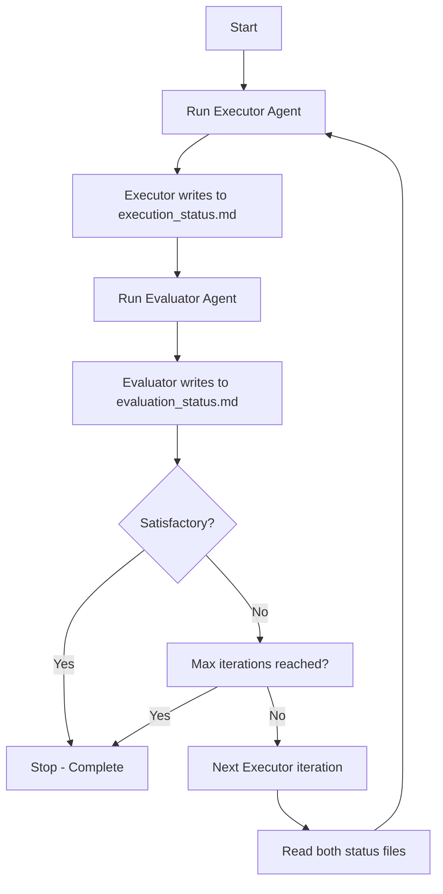

# Ralph Wiggum Loop

## Overview

The Ralph Wiggum technique is an iterative development methodology based on continuous AI agent loops. Named after Ralph Wiggum from The Simpsons, it embodies the philosophy of "persistent iteration despite setbacks."

At its core, Ralph is simple: **feed the same prompt to an AI agent repeatedly until the task is complete.** The "self-referential" aspect comes from the agent seeing its own previous work in files and git history, not from feeding output back as input.

`★ Insight ─────────────────────────────────────`
**The fundamental insight behind Ralph:**

AI systems often fail on complex tasks not because they're incapable, but because they need multiple attempts to refine their work. Ralph automates the retry loop while maintaining a stable prompt, making failures "deterministically bad" and thus predictable and tunable.
`─────────────────────────────────────────────────`

### Core Philosophy

1. **Iteration > Perfection** - Don't aim for perfect on first try. Let the loop refine the work.

2. **Failures Are Data** - When failures are predictable, you can systematically improve prompts and convergence criteria.

3. **Operator Skill Matters** - Success depends on writing good prompts with clear completion criteria, not just having a capable model.

4. **Persistence Wins** - Keep trying until success. The loop handles retry logic automatically.

### What Makes Ralph Different

Unlike typical AI workflows where you iterate on the prompt, Ralph keeps the prompt **stable** and iterates the **execution**. This separation makes debugging easier - if something fails, you know it's not because the prompt changed.

The "memory" between iterations is the **filesystem and git history**, not conversation context. Each iteration sees a modified codebase and can build upon previous work.

### Document Structure

This document describes two Ralph loop implementations:

**Custom Implementation** - A dual-agent architecture with separate executor and evaluator agents. Provides external validation and explicit audit trails.

**Claude Code Plugin Implementation** - A single-agent architecture using stop hooks to create in-session loops. Simpler, lower cost, but prone to premature completion.

---

## My Implementation Status

| Implementation | Status | Notes |
|----------------|--------|-------|
| **Claude Code Plugin** | Not enabled | Existing plugin by Daisy Hollman. Available at `~/.claude/plugins/cache/claude-code-plugins/ralph-wiggum/`. Needs to be enabled/installed. |
| **Custom Dual-Agent** | Not started | Design complete (see Custom Implementation section). Needs to be built from scratch: executor agent, evaluator agent, and orchestration logic. |

### Next Steps

1. **Enable Claude Code Plugin** - Install and test the existing plugin to understand the reference implementation
2. **Build Custom Implementation** - Create executor and evaluator agents with the dual-agent architecture
3. **Compare Results** - Test both implementations on similar tasks to validate trade-offs

---

## Custom Implementation

### Overview

This implementation uses a **dual-agent architecture** with explicit separation between execution and evaluation:

- **Executor agent** - Performs the work and writes progress to `execution_status.md`
- **Evaluator agent** - Judges the executor's work, writes findings to `evaluation_status.md`, and determines if the work is satisfactory

`★ Insight ─────────────────────────────────────`
**Three advantages over single-agent Ralph:**

1. **External validation** - Evaluator agent acts as an impartial judge, preventing the executor from falsely declaring completion just to escape the loop

2. **Separation of concerns** - Executor stays in "builder mode" while evaluator stays in "critic mode," avoiding cognitive dissonance from switching perspectives

3. **Explicit audit trail** - Status files create a persistent record of what was attempted and what feedback was given, making convergence easier to debug
`─────────────────────────────────────────────────`

### Loop Flow



### Execution Details

**1. Executor Agent** (`ralph-executor`)
- Reads original task prompt
- If not first iteration: reads `execution_status.md` and `evaluation_status.md` to understand previous work and feedback
- Performs work (writes code, runs tests, makes changes)
- Writes summary of actions taken to `execution_status.md`

**2. Evaluator Agent** (`ralph-evaluator`)
- Reads the original task requirements
- Reads `execution_status.md` to understand what was done
- Evaluates the work against requirements
- Writes detailed assessment to `evaluation_status.md`:
  - What was done well
  - What's missing or incomplete
  - Specific issues found (test failures, missing features, bugs, etc.)
  - Actionable feedback for next iteration
- Outputs completion decision: `SATISFACTORY` or `NEEDS_WORK`

**3. Loop Termination**
The loop stops when either:
- Evaluator outputs `SATISFACTORY`
- Maximum iterations reached
- Manual cancellation via `/cancel-ralph`

### Status File Formats

**execution_status.md**
```markdown
# Execution Status - Iteration N

## Work Completed
- [List of concrete actions taken]
- [Files created/modified]
- [Tests run and results]

## Current State
[Description of project state]

## Next Steps Planned
[What the executor plans to do next]
```

**evaluation_status.md**
```markdown
# Evaluation Status - Iteration N

## Assessment
[Evaluator's judgment of work quality]

## What's Working
[Positive feedback]

## Issues Found
- [Specific problems identified]
- [Test failures]
- [Missing requirements]

## Action Items for Next Iteration
[Specific, actionable feedback]

## Decision
SATISFACTORY or NEEDS_WORK
```

### Design Considerations

**Strengths**
- **Objective completion criteria** - Evaluator applies consistent standards, preventing premature completion
- **Better feedback quality** - Separate evaluator can provide more thoughtful critique
- **Convergence tracking** - Status files show progress over iterations

**Trade-offs**
- **Higher cost** - Each iteration requires 2 agent calls instead of 1
- **Feedback quality matters** - Vague evaluator feedback ("this is bad") won't help the executor improve
- **Executor must read feedback** - If executor ignores `evaluation_status.md`, the loop won't converge

**Best Practices**
- Evaluator should provide specific, actionable feedback (file paths, line numbers, exact issues)
- Executor should explicitly acknowledge reading previous status files
- Consider adding a third state file (`ralph-state.md`) to track overall progress across iterations

---

## Claude Code Plugin Implementation

### Overview

This implementation uses a **self-referential AI loop** that runs entirely within your Claude Code session. It's named after Ralph Wiggum from The Simpsons, embodying "persistent iteration despite setbacks."

`★ Insight ─────────────────────────────────────`
**Three clever architectural choices:**

1. **Stop hook interception** - Uses Claude's Stop hook API to block session exit and feed the same prompt back, creating a loop without external bash scripts
2. **State file as persistence** - Stores loop state in `.claude/ralph-loop.local.md` with YAML frontmatter for configuration and the prompt as content
3. **Transcript parsing** - Reads the conversation transcript (JSONL) to detect completion promises in the last assistant message
`─────────────────────────────────────────────────`

### How It Works

#### Starting the Loop

When you run `/ralph-loop "Build a REST API" --max-iterations 20`, the `setup-ralph-loop.sh` script creates a state file:

```bash
.claude/ralph-loop.local.md:
---
active: true
iteration: 1
max_iterations: 20
completion_promise: "null"
started_at: "2025-01-17T12:00:00Z"
---

Build a REST API
```

#### The Loop Mechanism (Stop Hook)

The magic happens in `stop-hook.sh` - a **Stop hook** registered in `hooks.json`:

**When Claude tries to exit**, the hook:

1. **Checks for active loop** - Looks for `.claude/ralph-loop.local.md`
2. **Reads the transcript** - Gets the last assistant message from the conversation
3. **Checks completion conditions**:
   - Has `max_iterations` been reached?
   - Does the output contain `<promise>TEXT</promise>` matching the configured promise?
4. **If NOT complete**:
   - Increments iteration counter
   - Returns JSON with `"decision": "block"` to prevent exit
   - The `"reason"` field contains the **original prompt** fed back as the next user message
   - Adds a system message showing iteration count

The JSON response that blocks exit:
```json
{
  "decision": "block",
  "reason": "Build a REST API",  // The original prompt
  "systemMessage": "🔄 Ralph iteration 2 | To stop: output <promise>DONE</promise>"
}
```

#### The Self-Referential Aspect

**"Self-referential" doesn't mean Claude talks to itself.** It means:

- The **same prompt** is repeated each iteration
- Claude's **previous work persists in files** (modified code, git history)
- Each iteration sees the **results of previous attempts**
- Claude iteratively improves by reading its own past work in the codebase

#### Completion Conditions

The loop stops when:

1. **Max iterations reached** - `iteration >= max_iterations`
2. **Completion promise detected** - The last assistant message contains `<promise>EXACT_TEXT</promise>`

The promise text must match **exactly** (literal string comparison).

### File Structure

```
ralph-wiggum/
├── .claude-plugin/
│   └── plugin.json          # Plugin metadata
├── commands/
│   ├── ralph-loop.md        # /ralph-loop command
│   ├── cancel-ralph.md      # /cancel-ralph command
│   └── help.md              # /help command
├── hooks/
│   ├── hooks.json           # Registers stop-hook.sh
│   └── stop-hook.sh         # Core loop logic (178 lines)
├── scripts/
│   └── setup-ralph-loop.sh  # Parses args, creates state file
└── README.md
```

### Key Implementation Details

**State file format** (`stop-hook.sh:20-25`):
- Uses `sed` to extract YAML frontmatter
- Validates numeric fields with regex before arithmetic
- Awk extracts everything after the second `---` as the prompt

**Transcript parsing** (`stop-hook.sh:69-95`):
- Transcript is JSONL (one JSON per line)
- Finds last line with `"role":"assistant"`
- Uses `jq` to extract text content from message

**Promise detection** (`stop-hook.sh:114-128`):
- Uses Perl with `-0777` flag for multiline matching
- Non-greedy `.*?` captures first `<promise>` tag
- Normalizes whitespace with `s/\s+/ /g`

**Safety features**:
- Input validation for all arguments
- Error messages with context when state corrupted
- Atomic file updates with temp files
- `set -euo pipefail` for strict bash execution

### Example Usage Flow

```bash
# User runs:
/ralph-loop "Fix failing tests in src/auth.test.ts. Output <promise>TESTS_PASSING</promise> when all green." --completion-promise "TESTS_PASSING" --max-iterations 15

# Iteration 1: Claude attempts fixes, runs tests, sees failures, tries to exit
# Stop hook: blocks, feeds same prompt back

# Iteration 2: Claude sees previous fixes in files, adjusts approach, runs tests, still failing, tries to exit
# Stop hook: blocks, feeds same prompt back

# ...

# Iteration 5: Tests pass, Claude outputs <promise>TESTS_PASSING</promise>
# Stop hook: detects promise, deletes state file, allows exit
```

`★ Insight ─────────────────────────────────────`
**Why this design is powerful:**

1. **No external orchestration** - The loop lives inside your session, not in a separate bash process
2. **State recovery** - If Claude crashes, the state file persists for potential resume (though current implementation doesn't resume)
3. **Prompt stability** - The prompt never changes, making debugging easier - "deterministically bad"
4. **File-based context** - Uses the filesystem and git as the "memory" between iterations, not conversation history
`─────────────────────────────────────────────────`

### Commands Reference

#### /ralph-loop

Start a Ralph loop in your current session.

**Usage:**
```bash
/ralph-loop "<prompt>" --max-iterations <n> --completion-promise "<text>"
```

**Options:**
- `--max-iterations <n>` - Stop after N iterations (default: unlimited)
- `--completion-promise <text>` - Phrase that signals completion

#### /cancel-ralph

Cancel the active Ralph loop.

**Usage:**
```bash
/cancel-ralph
```

### Philosophy

Ralph embodies several key principles:

1. **Iteration > Perfection** - Don't aim for perfect on first try. Let the loop refine the work.

2. **Failures Are Data** - "Deterministically bad" means failures are predictable and informative. Use them to tune prompts.

3. **Operator Skill Matters** - Success depends on writing good prompts, not just having a good model.

4. **Persistence Wins** - Keep trying until success. The loop handles retry logic automatically.

### When to Use Ralph

**Good for:**
- Well-defined tasks with clear success criteria
- Tasks requiring iteration and refinement (e.g., getting tests to pass)
- Greenfield projects where you can walk away
- Tasks with automatic verification (tests, linters)

**Not good for:**
- Tasks requiring human judgment or design decisions
- One-shot operations
- Tasks with unclear success criteria
- Production debugging (use targeted debugging instead)

### Real-World Results

- Successfully generated 6 repositories overnight in Y Combinator hackathon testing
- One $50k contract completed for $297 in API costs
- Created entire programming language ("cursed") over 3 months using this approach

### Learn More

- Original technique: https://ghuntley.com/ralph/
- Ralph Orchestrator: https://github.com/mikeyobrien/ralph-orchestrator
